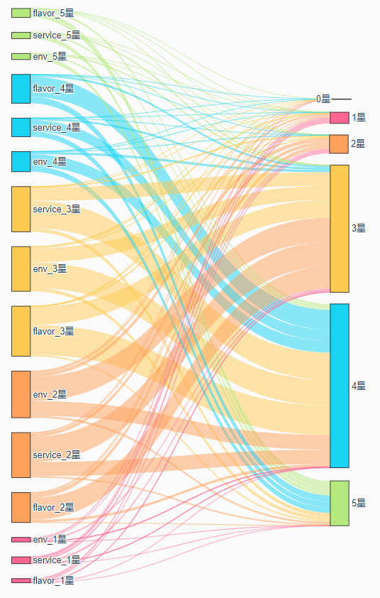
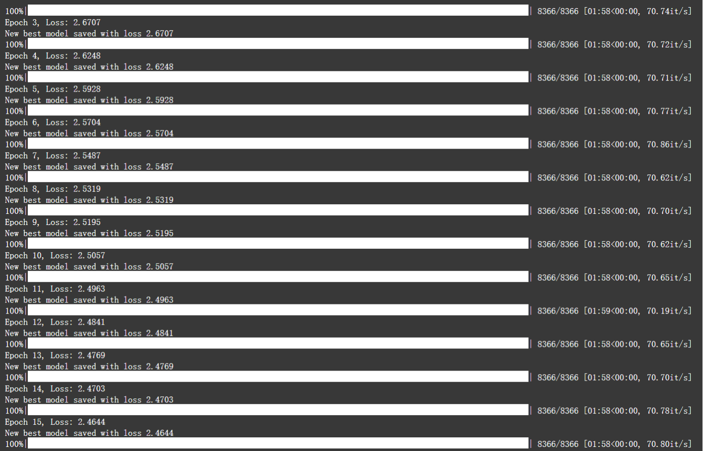
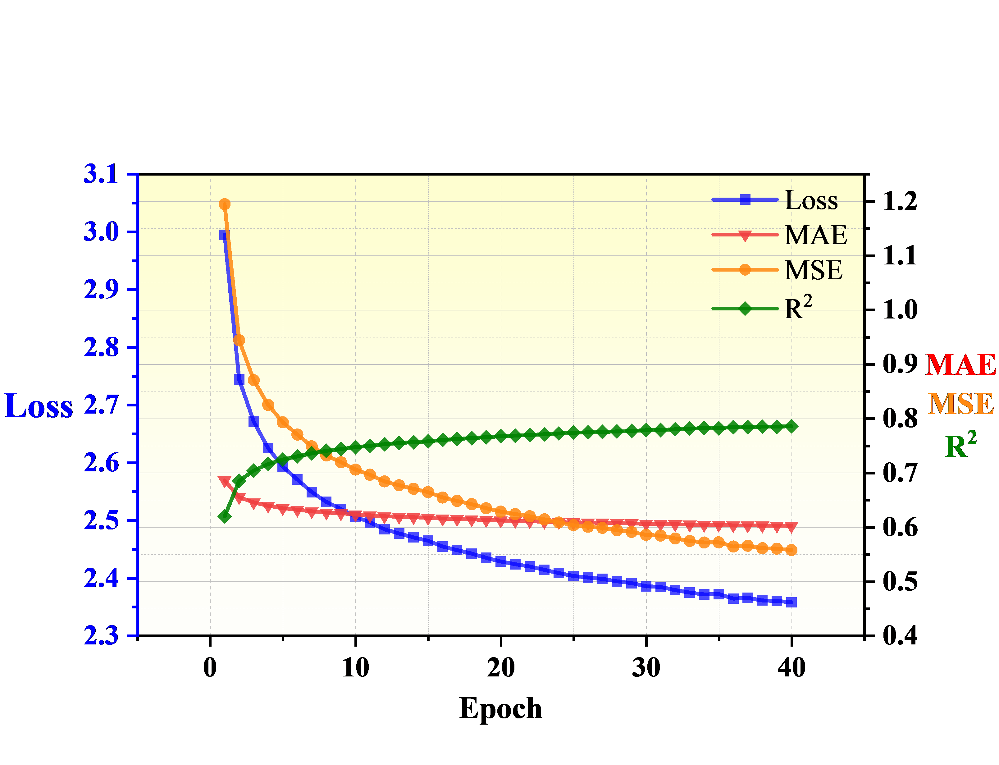
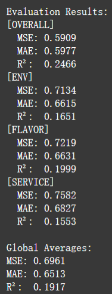
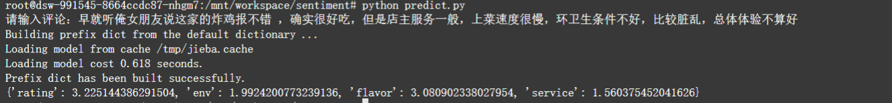

# **基于HAN餐厅评论情感分析**


## 项目简介：

本项目是基于大众点评餐厅评论，使用HAN模型，对评论进行多方位情感评分预测

文件夹格式：

```python

├── checkpoints/              # 模型保存目录（二进制数据）
├── configs/
│   └── base.yaml             # YAML格式配置文件
├── data/
│   ├── processed/            # 处理后数据目录
│   ├── intro.ipynb           # 数据介绍
│   └── ratings.csv           # CSV格式原始数据
├── img/                      # 图片资源目录
├── logs/                     # 训练日志目录
├── models/
|   └── han.py                # 模型定义目录
├── preprocessed/
│   └── preprocess.py         # 数据预处理
├── utils/
│   ├── __pycache__/
│   ├── data_loader.py        # 数据加载工具
│   ├── metrics.py            # 评估指标计算
├── evaluate.py               # 模型评估脚本
├── predict.py                # 预测脚本
├── README.md
└── train.py                  # 主训练脚本
```

数据集词云展示：


环境、口味、服务与总评分相关的桑基图如下所示：



## 快速开始：

根据你自己的data文件夹格式更改 base.yaml 配置文件中的路径参数和训练参数

运行数据预处理代码，在你设置的目标文件夹下（默认为data/processd）生成训练、测试、词表pkl文件

```bash
cd preprocessed
python preprocess.py
```

开始训练

```bash
cd ..
python train.py
```

训练中每一轮自动记录损失值，MSE，MAE，R² 指标，存储在xlsx文件中



损失指标评价图如下所示：



运行评估代码对模型进行评估：

```bash
python evaluate.py
```

最终评估指标如下所示：



运行推测代码，手动输入评论：

```bash
python predict.py
```




